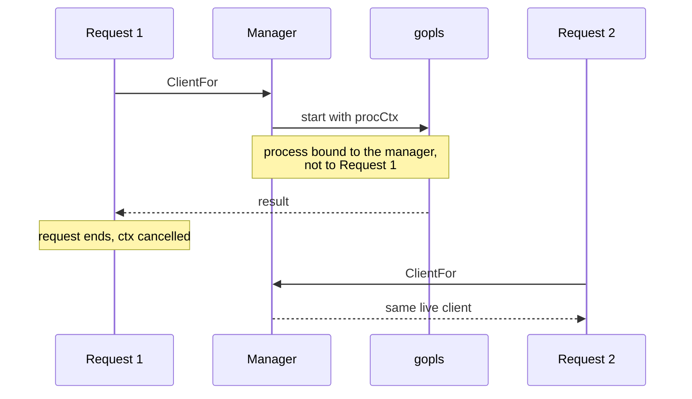

# Design Log #2 — Language server lifetime and symbol location

**Date:** 2026-08-20
**Status:** Implemented
**Affects:** `internal/lsp`, `internal/tools/tools_lsp.go`, `internal/content`
**Constraints from:** Design Log #1 (empty result ≠ failure to look)

## Background

`lsp_navigate` connects to a real language server — gopls, pyright,
rust-analyzer — over JSON-RPC 2.0 and offers definition, references, hover and
documentSymbol. Weakness #4 in `docs/WEAKNESSES.md` says a missing language
server must never be a dead end, so the tool falls back to a ripgrep symbol
search and reports the install command.

Unit tests covered the wire format against synthetic payloads and passed. The
first run against a real gopls did not.

## Problem

Three defects, each invisible to tests that never start a real server.

1. **Only the first navigation in a session worked.** Later calls returned
   `connection closed: EOF` and silently degraded to the ripgrep fallback.
2. **Symbol lookup landed inside doc comments.** gopls answered
   `no identifier found`, so navigation failed for essentially every documented
   declaration.
3. **A double failure reported success.** When the server errored and ripgrep
   was absent, the response was `status: "empty"` with zero locations.

Defect 3 is the serious one. It tells the agent a symbol has no references —
directly violating the line drawn in Design Log #1, Q4.

## Questions and Answers

**Q1. Why does only the first call work?**
A: `ClientFor` passed the *per-request* context into `exec.CommandContext`, so
the child process was killed when the tool call that started it returned. The
pool then handed every later call a client whose process was already dead.
Pooling was defeated entirely.

**Q2. What lifetime should a language server have?**
A: The manager's, not a request's. gopls takes seconds to index a module, so it
must be reused across calls; that is the only reason to pool it at all. The
manager owns a context cancelled in `Shutdown`.

**Q3. Should the request context still bound anything?**
A: Yes — the initialize handshake. A server that is slow to come up should fail
the current call, not hang it. So two contexts: `procCtx` for the process,
`initCtx` for the handshake.

**Q4. Why did symbol lookup land in a comment?**
A: `locateSymbol` took the first raw textual occurrence, and a Go doc comment
opens with the name of the thing it documents (`// NewPathGuard resolves…`). The
first hit is almost always the comment.

**Q5. Is stripping comments enough?**
A: No. A name inside a string literal is not an identifier either, and gopls
answers the same way. Both must be masked.

**Q6. Strip or mask?**
A: Mask — replace with spaces, preserving length. Stripping shifts every column
after the removal, and the whole point is to produce an exact position.

**Q7. What should a double failure return?**
A: An error, never an empty result. Per Design Log #1 Q4, "nothing found" and
"nothing could look" are different answers and conflating them is worse than
either.

## Design

**Lifetime.** `Manager` gains `procCtx` / `cancelProc`, created in `NewManager`
and cancelled in `Shutdown`.

```go
func newClient(procCtx, initCtx context.Context, ...) (*Client, error) {
    proc, err := runner.Start(procCtx, srv.Binary, srv.Args, root) // manager-owned
    ...
    if err := c.initialize(initCtx); err != nil { ... }            // request-owned
}
```



**Symbol location.** New `content.MaskNonCode(text, filename)` returns text of
identical length with comment bodies and string-literal contents replaced by
spaces. `locateSymbol` searches the masked copy, falling back to the raw text so
a symbol that genuinely only appears in prose is still found.

**Double failure.** `lspFallback` returns `protocol.Failure` with
`DEPENDENCY_MISSING` when the fallback search itself cannot run, naming both the
language server error and the fallback error in `details`.

## Implementation Plan

1. Manager-owned process context; split `newClient` signature
2. `content.MaskNonCode` with length preservation
3. `locateSymbol` searches the masked copy
4. `lspFallback` returns an error when both mechanisms fail
5. Regression tests, including one that fails if the lifetime bug returns

## Examples

❌ The bug — process dies with the request:
```go
client, err := newClient(ctx, m.runner, srv, root, m.logger) // ctx is the request's
```

✅ Fixed — process outlives the request that started it:
```go
client, err := newClient(m.procCtx, ctx, m.runner, srv, root, m.logger)
```

❌ Position inside the doc comment, gopls says "no identifier found":
```
// NewPathGuard resolves the workspace root.   ← line 62, first textual match
func NewPathGuard(root string) (*PathGuard, error) {   ← line 65, wanted
```

✅ Both failures visible, never silent:
```json
{ "status": "error", "error": { "code": "DEPENDENCY_MISSING",
  "details": { "languageServerError": "...", "fallbackError": "..." } } }
```

## Trade-offs

**Accepted.** Language servers now live until shutdown, holding memory for the
session. That is the cost of not re-indexing on every call.

**Accepted.** `MaskNonCode` uses per-language comment syntax, so an unlisted
language falls back to C-style rules and may mask imperfectly. A wrong mask
costs one failed lookup; the raw-text fallback catches the common case.

**Rejected.** Retrying the language server on `no identifier found` at nearby
positions. It guesses where fixing the position is deterministic.

**Rejected.** Using go/ast to locate Go symbols exactly. More precise for Go,
but `locateSymbol` must work for every language, and masking does.

## Verification Criteria

1. Four operations in one session all resolve through the language server, with
   `usedFallback` false on the later calls.
2. Cross-file definition resolves to the declaring file.
3. `locateSymbol` lands on the declaration for a documented symbol.
4. Both-failed returns an error, not an empty result.
5. A regression test fails if the lifetime bug is reintroduced.

---

## Implementation Results

**2026-08-20 — Implemented and verified against real gopls.**

All four operations in a single session, no fallback:

| Operation | Result |
| --- | --- |
| `documentSymbol` | 14 symbols from `pathguard.go`, correct kinds |
| `hover` | signature + doc comment for `(*PathGuard).Validate` |
| `references` | 3 call sites for `NewPathGuard`, across 3 files |
| `definition` | from `server.go` → `pathguard.go:65`, cross-file |

**Verification.**

| Criterion | Result |
| --- | --- |
| 1. Four ops, no fallback | ✅ verified by hand and by `TestIntegrationLSPNavigation` |
| 2. Cross-file definition | ✅ `server.go` → `pathguard.go:65` |
| 3. Lands on declaration | ✅ `TestLocateSymbolSkipsDocComments` |
| 4. Both-failed is an error | ✅ `TestLSPDoubleFailureIsAnErrorNotAnEmptyResult` |
| 5. Regression test bites | ✅ see below |

Criterion 5 was tested directly: the lifetime bug was reintroduced, the
integration test failed, the fix was restored, the test passed.

Tests: all packages passing, `internal/protocol` 91.7%, `internal/hints` 96.3%.
`go vet` and `gofmt` clean. Integration suite 8/8 passing (Databricks skipped —
no host configured).

**Deviations from the design.**

1. **`MaskNonCode` landed in `internal/content`, not `internal/lsp`.** The plan
   implied it belonged with the LSP code. It is general text handling with no
   LSP dependency, and `content` already owned the comment-syntax table, so
   putting it there avoided duplicating that table.

2. **The raw-text fallback in `locateSymbol` was not in the plan.** Added after
   noticing that a symbol appearing only in a comment — a TODO naming a
   type — would otherwise report "does not occur in this file", which is false.

3. **A fourth defect was fixed in passing.** `scripts/mcp-smoke.sh` lost its
   stderr output on failure: under `set -e` a failing pipeline exited before the
   log could be printed. Unrelated to LSP, found while wiring CI, fixed rather
   than left.

**Root cause note.** All three defects were invisible to unit tests because
those tests exercised parsing against synthetic payloads and never started a
process. The integration test added here starts a real one; that is the class of
test this defect required.
