# Design Log #3 — Feedback-Driven Agent improvements

**Date:** 2026-08-20
**Status:** Change A **implemented**. Changes B and C remain proposed.
**Affects:** `internal/tools` (schemas), `internal/protocol` (ToolError), `docs/`
**Constraints from:** Design Log #1 (envelope contract), Workspace Log #1

## Background

The Feedback-Driven Agent (FDA) pattern — Yoav Abrahami, Wix Engineering,
[article](https://www.wix.engineering/post/how-to-build-ai-agents-that-fix-themselves-without-bigger-prompts-more-context-or-another-llm) —
argues for building the loop rather than the prompt:

1. Agent drafts from minimal instructions
2. A **deterministic** validator (not an LLM judge) tests the artifact
3. On failure, a **smart error** carries the specific schema and documentation
   needed for self-repair, routing the agent back to step 1

Its key idea is **Dynamic Skill-Mapping**: the validator matches an error to the
exact how-to for that error, so the response is "an inline injection of the
specific knowledge needed", not a log line.

## Problem

Huginn already implements most of this, so the question is what is genuinely
missing rather than what sounds new.

**Already done.** Blueprint 3 of the article ("Heal on HTTP 400") describes an
error payload with `error_type`, `message`, `expected_schema` and a
`remediation_instruction_url`. Huginn's `ToolError` — `code`, `message`,
`retryable`, `hint`, `details` — is the same shape, arrived at independently
(Design Log #1). `FILE_TOO_LARGE` already returns the actual size, the
threshold, and the action to take. Validation is already deterministic: the path
guard, the read-only SQL check and the redactor are all programmatic, and the
project has no LLM judge anywhere.

**The real gap** is Blueprint 2, context bloat from tool schemas. Measured on
this machine:

| Payload | Bytes | ~Tokens |
| --- | --- | --- |
| Full `tools/list` | 13,677 | **3,419** |
| Without parameter descriptions | 8,666 | 2,166 |
| Without input schemas entirely | 4,242 | 1,060 |

Every session pays 3,419 tokens before any work happens — 43% of one full
response budget (`MAX_RESPONSE_TOKENS` defaults to 8,000). Prose inside the
schemas accounts for 5,011 bytes of that; the machine-readable structure
(types, enums, required) is 4,424.

A second, smaller gap: hints are prose. Nothing links an error to the document
that explains it, which is the Dynamic Skill-Mapping half of the pattern.

## Questions and Answers

**Q1. Does the article's lazy-loading trade-off actually hold for Huginn?**
A: Weakly, and the honest answer is "less well than for the article's example".
Its case is a WebMCP plugin with *dozens* of tools, where nearly all are unused
in any session. Huginn has 11, and a research session plausibly touches 4–6. The
saving is paid back in one extra round trip per distinct tool, each costing a
smart error of roughly 200–400 tokens plus latency. Stripping schemas entirely
saves 2,358 tokens and could spend most of it back. **This is the question that
decides whether the change is worth making at all.**

**Q2. Is there a variant with a better ratio?**
A: Yes — strip only the *prose descriptions inside* parameter schemas, keeping
types, enums and `required`. That saves 1,252 tokens (36%) while the agent can
still construct a valid call on the first attempt, so there is no extra round
trip to pay it back. Well-named parameters (`startLine`, `deepRead`, `concise`)
carry most of what the prose says.

**Q3. What breaks if schemas are stripped?**
A: Three things, and they are why Q1 matters. (a) `mcp-go` validates arguments
against the declared schema server-side; with no schema there is nothing to
validate against, so Huginn's own checks become the only guard. (b) Some clients
validate client-side before sending, and may refuse to send a call they cannot
check. (c) The model picks a tool from its *tool* description — those must stay
regardless.

**Q4. Should the Stage 2 goal-based judge be adopted?**
A: No. It would mean a second LLM reviewing results, and the article itself
warns of "structural blind spots" and the "student-grading-student dilemma".
Huginn is deliberately deterministic and read-only; adding a probabilistic
reviewer would contradict that and cost a model call per tool invocation.

**Q5. What would Dynamic Skill-Mapping look like here concretely?**
A: A `docs` field on `ToolError` pointing at a document that explains that error
class — for example `docs/errors/FORBIDDEN_SQL.md`. Because the path is inside
the workspace, the agent can read it with Huginn's own `local_file_content`.
The loop closes without leaving the server.

**Q6. Which errors would actually benefit?**
A: The ones where the agent's next move is non-obvious. `PATH_DENIED` and
`FILE_TOO_LARGE` are already fully self-describing and would gain nothing.
Candidates: `INVALID_INPUT` on GitHub query syntax (qualifier reference),
`FORBIDDEN_SQL` (what a read-only query may contain), and `INVALID_INPUT` from
ripgrep on a bad regex.

**Q7 — OPEN, needs your answer.** Is a session's typical tool count nearer 4 or
nearer 10? Q1 turns on this, and it is a fact about how you work that I cannot
measure yet. The metrics already record `huginn_tool_calls_total{tool}`, so a
week of real use would answer it.

**Q8 — OPEN, needs your answer.** Is the 3,419-token tool list actually hurting
you today, or is this optimising something that is not a problem? Nothing
observed so far suggests it is a bottleneck.

## Design

Three changes, independently shippable, in increasing order of risk.

**A. Error-to-document mapping (low risk, small win).**

```go
type ToolError struct {
    // ...existing fields
    Docs string `json:"docs,omitempty"` // workspace-relative path
}
```

A table maps error code → document; only the codes from Q6 get an entry. Write
`docs/errors/<CODE>.md` for those. The agent reads them with `local_file_content`.

**B. Schema slimming (medium risk, measured 1,252-token win).**

Drop prose descriptions from parameter schemas, keep types, enums and
`required`. Tool descriptions are untouched. Full descriptions move into
`docs/tools/<tool>.md`, which an `INVALID_INPUT` error points at via change A.

**C. Lazy schemas (high risk, 2,358-token win, NOT recommended yet).**

Register tools with no input schema; on the first malformed call return the full
schema as a smart error. This is the article's Blueprint 2 verbatim. Blocked on
Q7 and Q8, and on the `mcp-go` validation question in Q3.

```mermaid
flowchart LR
    A["Agent calls a tool"] --> V{"Deterministic&#160;validation"}
    V -->|valid| R["Envelope with data and hints"]
    V -->|invalid| E["ToolError: code, hint,&#160;details, docs path"]
    E --> D["Agent reads the doc&#160;via local_file_content"]
    D --> A
```



## Implementation Plan

1. Change A: `Docs` field, the code→document table, and documents for the Q6
   error codes
2. Measure the tool list again to confirm A costs nothing in `tools/list`
3. Change B behind a config flag, default off, so the two shapes can be compared
4. Collect `huginn_tool_calls_total` over real use to answer Q7
5. Revisit C only if Q7 and Q8 justify it

## Examples

✅ Skill-mapped error — the agent can repair without guessing:
```json
{ "code": "FORBIDDEN_SQL", "retryable": false,
  "message": "statement contains the forbidden keyword MERGE",
  "hint": "This tool is read-only. Express it as a SELECT.",
  "docs": "docs/errors/FORBIDDEN_SQL.md" }
```

❌ What the article warns against — a bare log line the agent cannot act on:
```json
{ "error": "invalid query" }
```

✅ Slimmed parameter schema — structure kept, prose moved out:
```json
{ "minify": { "type": "string", "enum": ["none", "standard", "symbols"] } }
```

❌ Stripping the tool description too — the agent can no longer choose the tool:
```json
{ "name": "github_search_code", "inputSchema": { "type": "object" } }
```

## Trade-offs

**Accepted (A).** One more field on every error and a handful of documents to
keep current. `docs,omitempty` costs nothing when unset.

**Accepted (B).** Losing parameter prose makes a few arguments less obvious.
Mitigated by good names, retained enums, and change A pointing at the full
reference on failure.

**Rejected.** A goal-based LLM judge (Q4) — contradicts the deterministic,
read-only design and the article's own warning.

**Deferred.** Full lazy schemas (C) — the token maths does not clearly favour it
at 11 tools, and it may trade tokens for latency. Needs Q7 and Q8 answered.

## Verification Criteria

1. `tools/list` after change B is ≤ 2,200 tokens, measured the same way.
2. Every error code listed in Q6 resolves to a document that exists.
3. A malformed call to each Q6 code returns a `docs` path the agent can read
   with `local_file_content` without leaving the workspace.
4. No regression: all existing tests pass, the MCP handshake still lists 11 tools.
5. Change B is reversible by a config flag, and both shapes are measured.

---

## Implementation Results

*Appended during implementation. The sections above are frozen.*

**2026-08-20 — Change A implemented. B and C not approved, not built.**

`ToolError` gained a `Docs string` field with `omitempty`, plus a `WithDocs`
method. Eight error sites carry a reference, across three repair topics:

| Topic | Sites | Document |
| --- | --- | --- |
| GitHub query syntax | 3 in `buildCodeQuery`, 1 on GitHub's own 422 | `docs/errors/github-query-syntax.md` |
| Read-only SQL | 3 in `ValidateReadOnlySQL` | `docs/errors/read-only-sql.md` |
| ripgrep patterns | 1 on a rejected pattern | `docs/errors/ripgrep-patterns.md` |

**Verification.**

| Criterion | Result |
| --- | --- |
| 1. `tools/list` ≤ 2,200 tokens | **N/A** — that criterion belongs to change B, which was not built. Measured anyway: 13,677 bytes / ~3,419 tokens, byte-identical to before, confirming A costs nothing upfront. |
| 2. Every referenced document exists | ✅ `TestEveryDocsURLPointsAtAFileThatExists` resolves each URL to a repository file and fails if one is missing or under 200 bytes |
| 3. Reference reaches the agent | ✅ verified live over stdio: a stacked-statement refusal returns `FORBIDDEN_SQL` with the `docs` URL; also `TestRefusedSQLCarriesADocsReference` asserts it survives JSON encoding |
| 4. No regression | ✅ `make lint` clean, `go test -race ./...` all 10 packages passing, handshake still lists 11 tools |
| 5. Reversible by config flag | **N/A** — belongs to change B |

**Deviations from the design.**

1. **`docs` carries a URL, not a workspace-relative path.** Q5 claimed the agent
   could read the document with Huginn's own `local_file_content`. That is wrong
   for an installed binary: the source repository is frequently absent from the
   machine, and a relative path would resolve against whatever `WORKSPACE_ROOT`
   is configured — under `~/Documents/PROJECTS` it would point at
   `PROJECTS/docs/errors/…`, which does not exist. A URL always resolves, and it
   matches the article's `remediation_instruction_url` exactly. The cost is that
   reading it needs network access.

2. **No error-code → document table.** The design specified one. It cannot work:
   `INVALID_INPUT` covers GitHub query syntax, ripgrep patterns, line numbers and
   several other unrelated repairs, so a code-keyed table would hand the agent
   the wrong document more often than the right one. References are attached at
   the error site instead. `TestSameCodeCanCarryDifferentDocs` pins this down.

3. **Documents are named by topic, not by code** — `github-query-syntax.md`
   rather than `INVALID_INPUT.md`. Follows directly from deviation 2.

4. **One extra site beyond Q6's three topics**: GitHub's own 422 response in
   `ghclient.MapError`. Same repair topic as the locally-detected query errors,
   so it would have been odd to leave it bare.

**Explicitly not done.** `PATH_DENIED` and `FILE_TOO_LARGE` carry no reference,
per Q6 — their hints already contain the whole repair.
`TestSelfExplanatoryErrorsCarryNoDocsReference` asserts they stay bare, so the
field does not spread by habit.

**Still open.** Q7 and Q8 are unanswered, so changes B and C stay proposed. The
metrics needed for Q7 (`huginn_tool_calls_total{tool}`) are already being
recorded.
