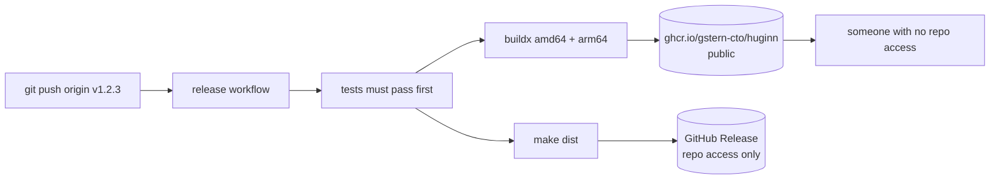

# Design Log #4 — Distribution: public image, private source

**Date:** 2026-08-21
**Status:** Implemented. No tag pushed — publishing is a separate decision.
**Affects:** `.github/workflows/`, `internal/tools/server.go`, a new install script
**Constraints from:** Workspace Log #1

## Background

Huginn currently only runs where it was built. Using it on a second machine
means cloning a private repository and having a Go toolchain, which is a poor
trade for a tool whose whole point is that it is one static binary.

Two distribution shapes were considered (Design Log #3 is unrelated; this
follows the discussion of running the whole app in a container). The user's
stated goal was "use it on another machine without worrying about OS", with the
added requirement of **giving the tool to someone without giving them the code**.

## Problem

The repository is private and must stay private, but the tool should be
installable by someone with no access to it.

A container image is the natural answer, and the multi-stage build already
produces one that carries no source. But nothing publishes it, so today the only
way to get the image is to build it — which requires the source, defeating the
purpose.

## Questions and Answers

**Q1. Does a published image leak the source?**
A: No. Verified against the built image: 316 files, and zero matches for `*.go`,
`go.mod`, `go.sum`, `*.md` or `Dockerfile`. The multi-stage build discards the
stage that holds the source; only the final stage's layers are published.

**Q2. Does it leak anything?**
A: The package structure, yes. Go embeds source file paths for stack traces —
553 references such as `internal/security/pathguard.go`. Grepping the binary for
function bodies and comments returns 0 matches, so file and package *names* are
exposed but no code. `-trimpath -ldflags="-s -w"` already removes absolute
paths, the symbol table and DWARF. Obfuscation would close this and was
rejected: it breaks stack traces and buys very little.

**Q3. Can the image be public while the repository stays private?**
A: Yes — on GitHub, package visibility is independent of repository visibility.
This is what makes the requirement satisfiable at all. **Decision: the package
is public**, so a recipient needs no credentials and no repository access.

**Q4. What triggers a publish?**
A: **Version tags only.** Publishing on every push to `main` would mean the
image changes under people who did not ask for a new version. A tag is a
deliberate act.

**Q5. Is there a `latest` tag?**
A: Yes, but it moves only on a release, never on a `main` commit. That keeps the
convenience of a first-time `docker pull` without the "it worked yesterday"
failure mode of a `latest` that tracks a branch. Version tags themselves are
immutable.

**Q6. Which architectures?**
A: `linux/amd64` and `linux/arm64`. Apple Silicon is common enough that an
amd64-only image would run under emulation — slow and occasionally broken.

**Q7. How does the released binary know its version?**
A: `ServerVersion` is currently a `const`, so every build reports `0.1.0`
forever. `-X` can only override a `var`, so it becomes a `var` and the workflow
injects the tag. A release that misreports its own version is a support problem
waiting to happen.

**Q8. Should provenance attestations be attached?**
A: No. Recent buildx attaches them by default, recording the source repository
URL and build parameters in the registry. Harmless here — the repo name is
already in the module path — but for a private repo published as a public image
the default should be off, not on. `--provenance=false --sbom=false`.

**Q9. Binaries as well as the image?**
A: Yes, attached to the GitHub Release. Docker is a heavier dependency than the
static binary it would replace, so both channels stay open and the recipient
picks. Note the Release itself is only visible to people with repository access;
the image is the channel for everyone else.

## Design

**Registry.** `ghcr.io/gstern-cto/huginn` — lowercase is required by the
registry. Public package, private repository.

**Trigger.** A pushed tag matching `v*`. Nothing publishes on `main`.

**Tags produced.** For `v1.2.3`: `1.2.3`, `1.2`, and `latest`.



**Version injection.** `ServerVersion` changes from `const` to `var` so the
workflow can set it:

```
-ldflags "-s -w -X github.com/gstern-CTO/huginn/internal/tools.ServerVersion=1.2.3"
```

**Install script.** `huginn-docker.sh`, mirroring `huginn.sh`, registering the
container form with Claude Code. It takes `--workspace` because the mount path
differs per machine, pulls the image if absent, and verifies the registration
connects.

## Implementation Plan

1. `ServerVersion` from `const` to `var`; confirm `-X` overrides it
2. `.github/workflows/release.yml`: test → buildx multi-arch push → binaries on
   the Release
3. `huginn-docker.sh` with the same verification as `huginn.sh`
4. README section for the image-only path
5. Do **not** push a tag as part of this: publishing a public image is an
   outward-facing act and is the user's call, separately

## Examples

✅ What a recipient runs — no repository access, no Go, no ripgrep:
```bash
docker pull ghcr.io/gstern-cto/huginn:0.1.0
./huginn-docker.sh --workspace ~/code --git-token ghp_...
```

❌ What publishing on `main` would mean:
> "It worked yesterday" — because the image moved under them without a release.

✅ Immutable version, movable convenience tag:
```
ghcr.io/gstern-cto/huginn:1.2.3   pinned forever
ghcr.io/gstern-cto/huginn:latest  moves, but only on a release
```

## Trade-offs

**Accepted.** The package structure is visible in the binary (Q2). The
alternative is obfuscation, which costs debuggability for very little.

**Accepted.** A public package means anyone can pull the tool. It is MIT
licensed, so this is consistent; it is the *source* that stays private.

**Accepted.** Two distribution channels to keep working. They share one
workflow, and the binaries are one `make dist` away regardless.

**Rejected.** Publishing on every `main` push. Convenient for a fleet you
control, wrong for anything anyone else depends on.

**Rejected.** Docker Hub. GHCR needs no extra account or secret — the workflow's
own token can push — and it keeps the artefact beside the code.

## Verification Criteria

1. `ServerVersion` is overridable: a build with `-X` reports the injected value.
2. The workflow is valid and its image reference is lowercase.
3. `huginn-docker.sh --dry-run` prints a correct `docker run` with the token
   redacted, and rejects a missing workspace.
4. A container started from the locally built image registers and reports
   Connected, proving the `docker run` form the script writes is correct.
5. No tag is pushed by this change.

---

## Implementation Results

*Appended during implementation. The sections above are frozen.*

**2026-08-21 — Implemented. Nothing published yet.**

Added `.github/workflows/release.yml` (test → image → binaries),
`huginn-docker.sh`, and version injection through both the Dockerfile and
`make dist`.

**Verification.**

| Criterion | Result |
| --- | --- |
| 1. Version overridable | ✅ `-X` build reports `9.9.9-test`; plain build reports `0.1.0-dev`; the Docker `--build-arg VERSION=8.8.8` path reports `8.8.8` |
| 2. Workflow valid, image lowercase | ✅ parses to jobs `test, image, binaries`, trigger `push.tags: [v*]`, `ghcr.io/gstern-cto/huginn` is lowercase |
| 3. Dry run correct and redacted | ✅ prints the full `docker run` with `GITHUB_TOKEN=***redacted***`; rejects a missing `--workspace` and reports the path the user typed for a bad one |
| 4. Container form connects | ✅ registered against the locally built image under a throwaway name and Claude Code reported **Connected**; removed afterwards |
| 5. No tag pushed | ✅ 0 local tags, 0 remote tags |

**Deviations from the design.**

1. **`ServerVersion` default changed from `0.1.0` to `0.1.0-dev`.** The plan only
   said to make it a `var`. Leaving the default identical to a plausible release
   version means a dev build is indistinguishable from a release in a bug report.
   The `-dev` suffix makes the difference obvious at a glance.

2. **`make dist` and the Dockerfile both gained version plumbing.** The plan
   mentioned the ldflags line but not that two build paths need it. Both are
   no-ops when `VERSION` is unset, so a local build is unchanged.

3. **`huginn-docker.sh` gained `--no-pull` and `--image`.** Not planned, but
   without them the container form could not be tested at all before the image
   is published — which is exactly what criterion 4 requires.

**A leak found by running it, and fixed.** For the container form the token is
part of the *command*, not an environment variable, so `claude mcp list` prints
it in clear text — and the script's own verification step echoed that output
verbatim, defeating the redaction applied everywhere else. The status line is
now scrubbed before display, and the script warns that `claude mcp list` will
still show it. This is a genuine disadvantage of the container form over the
native one, and it is stated rather than hidden.

**Not done, deliberately.** No tag was pushed, so nothing is published. The
image becomes public the moment a `v*` tag lands, which is the user's call.
