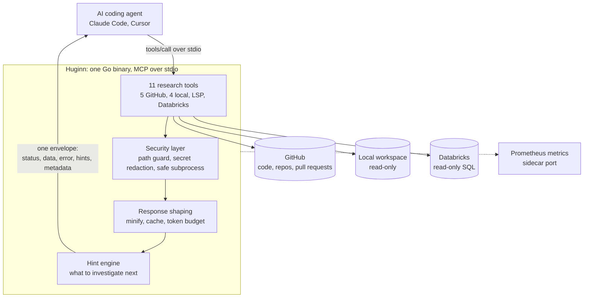
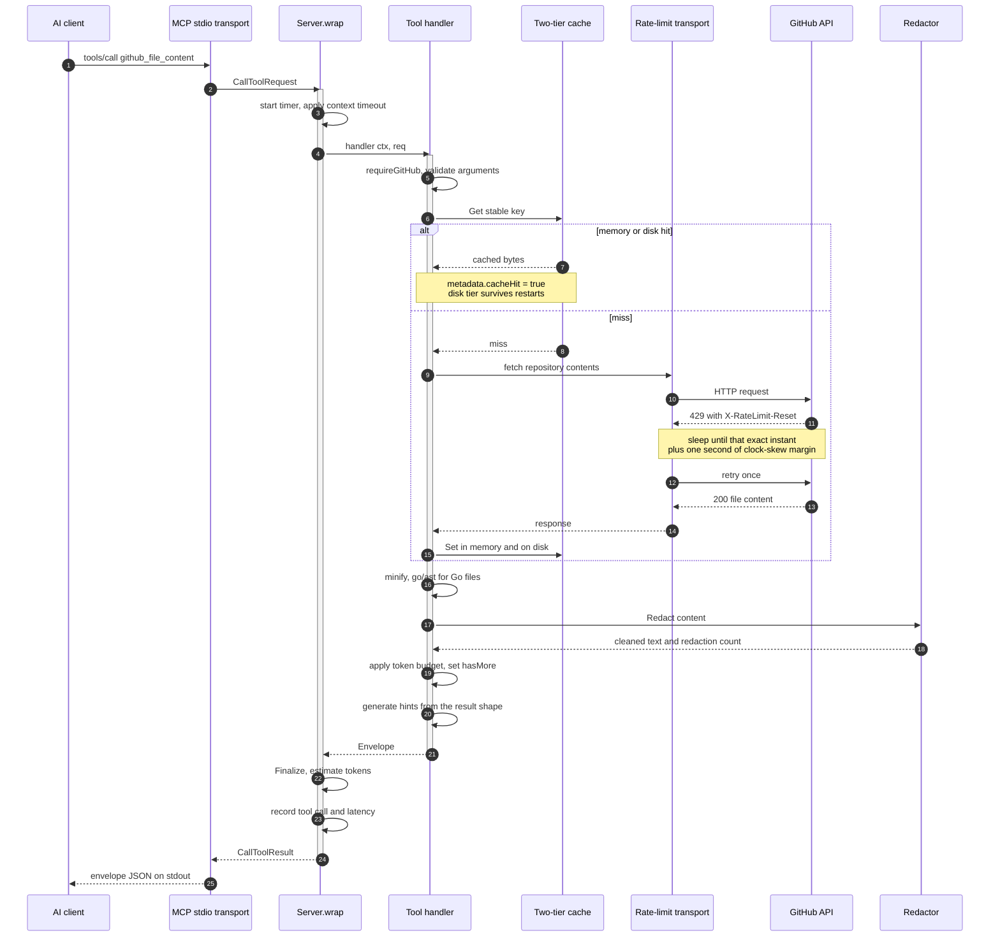
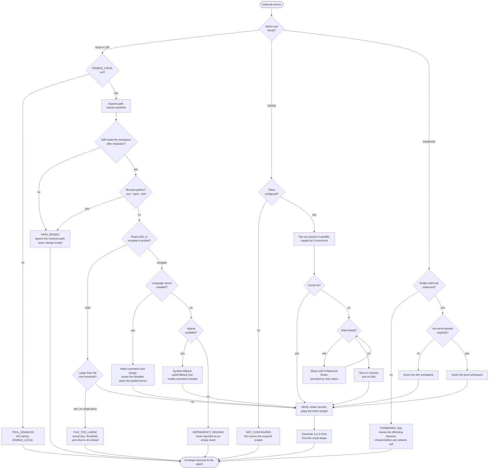
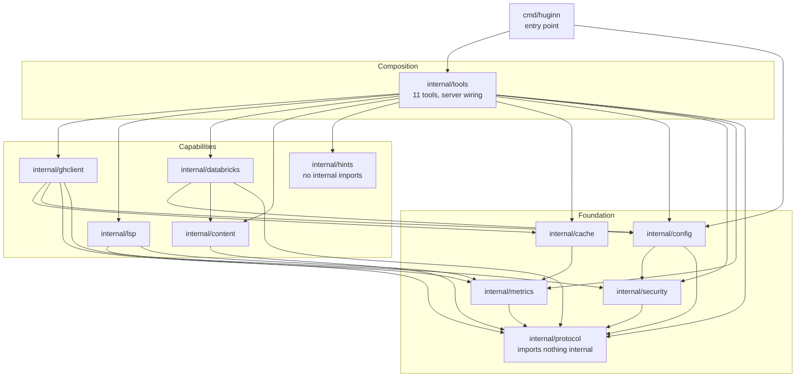

# Huginn Architecture

Three views of the same system: what it is for, how data actually moves through
it, and where every decision branches.

---

## 1. Purpose

An engineer's real questions are rarely answerable from one place. "Where is
this implemented" lives in code, "when was it introduced and why" lives in
pull request history, and "what does the data show this week" lives in a
warehouse. Huginn puts all three behind one MCP server so an AI agent can
follow a question wherever it leads, and shapes every answer so that following
it stays cheap and safe.

The three things worth noticing:

- **Every answer leaves through the same pipeline.** Nothing reaches the agent
  without passing the redactor, the token budget and the hint engine.
- **One envelope for all eleven tools.** The agent learns one response shape,
  not eleven.
- **stdout is the transport.** Logs go to stderr; metrics go to their own port.

---

## 2. Data flow

A single `github_file_content` call, end to end. This is the path that exercises
caching, rate limiting, minification and redaction together.

Bulk calls differ in one respect: `github_search_code` fans its queries out
through `errgroup` capped at five concurrent requests, and a query that fails
returns its own error alongside the successful queries' results rather than
failing the whole call.

---

## 3. Request lifecycle

Where every request branches, and what the agent gets back at each dead end.
No branch terminates without a structured error carrying a hint.

### Why the dead ends matter

Every error box above is a place where the reference implementation returned a
bare string and left the agent stuck. Each one here carries a machine-readable
code, a retry flag, a hint, and error-specific details — the size and threshold
for a file that was too large, the resolved path for one that was denied, the
keyword for SQL that was refused.

The `DEPENDENCY_MISSING` box is the sharpest example. When neither a language
server nor ripgrep can answer, the response must be an error. Reporting it as
an empty result would tell the agent the symbol has no references, which is a
confidently wrong answer rather than a missing one.

---

## Package layout

The graph below is the real one, extracted with `go list`, not a sketch.

Dependencies point one way. `protocol` imports nothing internal and everything
that produces a response depends on it, so the envelope contract cannot
develop a cycle with the code that fills it. `hints` imports nothing at all —
it is pure functions over result shapes, which is why it is the most heavily
tested package in the tree.
